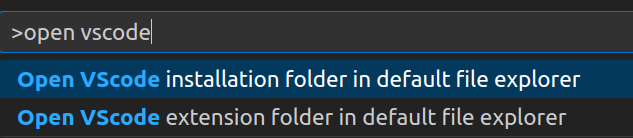

# VS Code paths
In the need to browse VS Code files? Here is a little quick'y
## Features

- Contributes two commands to the Command Pallete `(Ctrl|⌘)+Shift+P` for opening the VS Code installation and extensions folders respectively

## Settings

- You can add specify your custom key binding by click the command settings icon 

